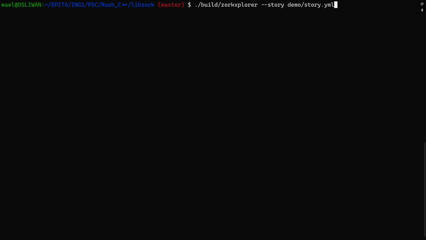

# Libzork - C++ Interactive Fiction Engine

> **Showcase Repository:** To comply with EPITA's anti-plagiarism regulations, the raw source code of this project is kept private. This repository serves as an architectural showcase documenting the engine design, the object-oriented structure, and the core graph implementation.

## 📖 Project Context

**Libzork** is a C++ development project. The goal is to build a modular engine capable of parsing and executing "Choose Your Own Adventure" stories (inspired by the classic text-based game *Zork*). The engine builds a directed graph representation of the story in memory and executes it through a Command Line Interface (CLI).

## 🏗️ Architectural Overview

The core architecture heavily relies on Modern C++ idioms (smart pointers, move semantics) and strong Object-Oriented principles. The logic is cleanly separated into data representation and execution contexts:

### 1. Graph-Based Story Engine (`Story`, `Node`, `Choice`)
The narrative is represented as a directed graph:
* **Nodes** represent the different scenes or rooms.
* **Choices** represent the directed edges linking the nodes.

The graph is safely managed in memory using standard C++ smart pointers (`std::unique_ptr` and `std::shared_ptr`). This ensures strict ownership rules and prevents memory leaks during complex cyclic story paths (e.g., going back and forth between two rooms).

### 2. Interactive Execution (`InteractiveRunner`)
The execution logic is decoupled from the story data. The `InteractiveRunner` parses user inputs via standard input streams (`std::istream`), displays the current node's description to the standard output (`std::ostream`), and traverses the graph based on the user's valid choices.

## 🚀 Technical Highlights

### Safe Memory Management & Factory Patterns
The project strictly prohibits raw `new`/`delete` calls. Object creation is encapsulated within factory functions returning unique pointers, ensuring exception safety and clean boundaries:

```cpp
// Example of the Factory pattern used to instantiate the CLI runner
namespace libzork::runner {
    InteractiveRunner::InteractiveRunner(std::unique_ptr<story::Story> story, std::istream& is, std::ostream& os)
        : Runner(std::move(story)), is_(is), os_(os) {}
}
```

### Decoupled Logic
By decoupling the `Story` (data structure) from the `Runner` (execution context), the engine is highly extensible. Adding a new interface (like a GUI or a Web output) simply requires implementing a new runner class without altering a single line of the core graph logic.

## 🎯 Demonstration

A pre-compiled version of the engine and a sample story are available for testing.

1. Go to the **[Releases](../../releases)** section and download the `libzork_demo.tar.gz` archive.
2. Extract the archive and go into the `demo/` directory:
```bash
tar -xvf libzork_demo.tar.gz
cd demo
```

3. **Play the demo story (Interactive Mode):**
```bash
./zorkxplorer --story story.yml
```

*Expected behavior: The terminal prints the room description and waits for the user to type the number corresponding to their choice, navigating through the graph until an end node is reached.*

<p align="center">
  
</p>
